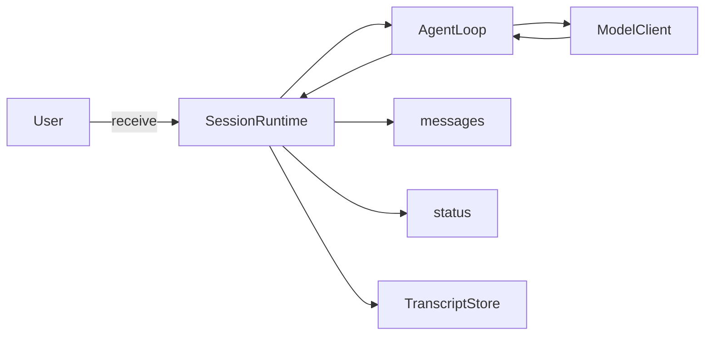

# Mini Coding Agent · Episode 01

这是 **Mini Coding Agent** 教学系列第一集的完整配套代码：**Agent 怎么连续思考？从一次模型调用到 SessionRuntime**。

本集用一个无需 API Key、完全离线的 Mock 模型回答三个问题：

- 为什么一次模型调用不等于 Agent；
- `AgentLoop` 和 `SessionRuntime` 如何分工；
- 如何分别保存内存中的 `messages` 和持久化的 Transcript。

## 架构



`SessionRuntime` 管整场任务的消息、状态、持久化和停止；`AgentLoop` 只管当前用户回合中的模型迭代。

## 快速开始

需要 Node.js 20 或更高版本。

```bash
npm install
npm run dev
npm test
npm run lint
npm run typecheck
```

一次执行全部检查：

```bash
npm run check
```

构建后运行：

```bash
npm run build
npm start
```

## 示例输出

```text
Mini Coding Agent - Episode 01
Type a message, or type "exit" to quit.

[SessionRuntime] session created: 88a2c302-...
You: 帮我检查登录失败的原因
[SessionRuntime] message received
[Transcript] user message persisted
[SessionRuntime] status: idle -> running
[AgentLoop] building messagesForQuery
[AgentLoop] messagesForQuery ready
[ModelClient] generating response
[AgentLoop] model response received
[Transcript] assistant message persisted
[AgentLoop] finished
[SessionRuntime] status: running -> idle

Assistant:
我需要先查看项目目录，并搜索与 login、auth 和 token 相关的文件。当前版本尚未接入文件工具，下一集将实现 Read Tool。

You: exit
```

## 目录说明

```text
src/
├── agent/       # AgentLoop：推动当前回合
├── cli/         # 终端输入与输出
├── context/     # 构造 messagesForQuery
├── model/       # ModelClient 接口与离线 Mock
├── runtime/     # SessionRuntime：管理整场任务
├── transcript/  # TranscriptStore 与 JSONL 实现
└── types/       # Message、ModelResponse、SessionStatus
tests/           # 核心行为测试
transcripts/     # 本地运行轨迹；JSONL 文件不会提交
docs/            # 教学架构文档
```

## 一条消息的生命周期

1. CLI 调用 `SessionRuntime.receive()`。
2. Runtime 将 user message 加入内存 `messages`。
3. Runtime 先把 user message 写入 Transcript。
4. 状态从 `idle` 切换为 `running`。
5. Runtime 启动 `AgentLoop.run()`。
6. Loop 用 `buildMessagesForQuery()` 构造模型本轮可见上下文。
7. Loop 调用与供应商无关的 `ModelClient.generate()`。
8. Runtime 接收并保存 assistant message，同时写入 Transcript。
9. 模型返回 `stop` 后 Loop 结束，Runtime 恢复为 `idle`。

`messages` 是当前会话的内存状态；`TranscriptStore` 是追加写入、可审计的任务轨迹。`messagesForQuery` 则只是本轮真正交给模型的上下文。第一版保留所有 system message 和最近 20 条非 system message；后续课程才会加入 Token Budget 和 Compact。

## 本集实现

- 不可变 `Message` 数据；
- 集中的 `SessionStatus`；
- `SessionRuntime` 与 `AgentLoop`；
- `ModelClient` 和无需网络的 `MockModelClient`；
- JSONL `TranscriptStore`；
- 可中止与最大迭代保护；
- 交互式 CLI；
- Vitest 测试、TypeScript strict、ESLint、Prettier。

## 暂未实现

本集**没有**实现 Read、Grep、Edit、Bash、Tool Protocol、Permission、Compact、完整 Resume、Replay、多 Agent、真实模型 API 或 Web UI。

## 下一集

Episode 02 将实现 **Tool Protocol × Read Tool**。推荐从 `ModelResponse` 的可观察输出结构和 `AgentLoop` 的迭代分支扩展，让模型第一次真正读取本地文件，同时继续由 `SessionRuntime` 管理生命周期。

## 安全说明

当前版本不会执行系统命令、修改用户文件、访问网络或读取项目目录。Mock 模型不需要 API Key；`.env` 和运行生成的 `transcripts/*.jsonl` 默认不会提交。

更多设计解释见 [Episode 01 架构文档](docs/episode-01-architecture.md)。

## License

[MIT](LICENSE)
