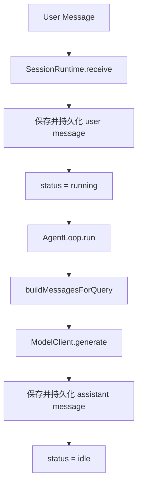
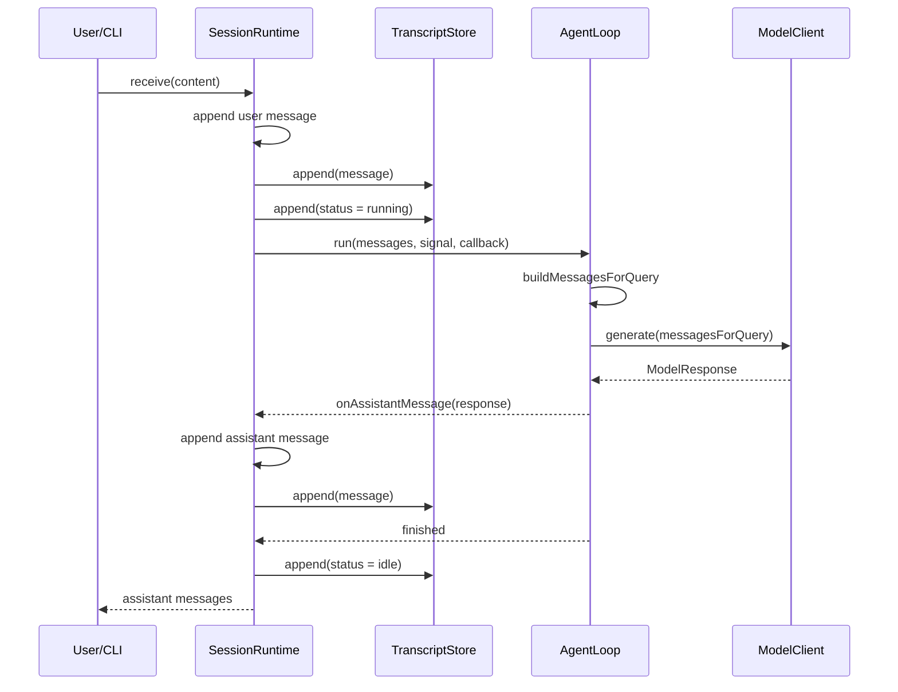

# Episode 01 架构：从一次调用到 SessionRuntime

## 一次模型调用为什么不是 Agent

一次调用只有“输入消息，得到回复”。它不知道这条消息属于哪个任务，也不负责保存历史、记录状态、连续执行或响应停止。

Agent 至少还需要一个运行结构，把每次调用放进可管理的任务生命周期里：什么时候开始、把什么交给模型、结果存到哪里、失败或停止后是什么状态。

## 为什么只有 while 循环还不够

`while` 能让模型被反复调用，却回答不了这些问题：

- 用户消息是否已经持久化？
- 当前任务是 idle、running 还是 failed？
- 谁响应用户中断？
- 谁拥有完整消息历史？
- 一次迭代失败后，整场任务进入什么状态？

所以本项目把“回合执行”和“会话管理”分开。

## AgentLoop 的职责边界

`AgentLoop` 管当前回合：

1. 构造 `messagesForQuery`；
2. 调用 `ModelClient`；
3. 上报可观察的 assistant response；
4. 根据 `stop/continue` 决定是否继续；
5. 用 `maxIterations` 防止无限循环；
6. 检查 `AbortSignal`。

它不创建 session，不选择 transcript 路径，也不拥有全局 status。这样将来换成真实模型或加入工具协议时，不必重写会话生命周期。

## SessionRuntime 的职责边界

`SessionRuntime` 管整场任务：

- 拥有 `sessionId`、完整 `messages` 和 `status`；
- 保证 user message 先保存、先持久化，再启动 Loop；
- 将 Loop 上报的 assistant response 变成 Message；
- 把可观察事件追加进 Transcript；
- 创建 `AbortController`，处理成功、失败和停止。

构造时会异步写入 `session_created`。`ready()` 可以显式等待初始化；`receive()` 和 `stop()` 也会自动等待它，因此事件顺序稳定。

## messages 与 messagesForQuery

`messages` 是 Runtime 当前保存的相对完整会话轨迹。`messagesForQuery` 是某一次调用真正交给模型的上下文，两者不能混为一谈。

Episode 01 的最小策略是：保留全部 system message，再保留最近 N 条非 system message，默认 N 为 20。函数返回新数组，不修改原始会话。以后加入 Token Budget 和 Compact 时，只需要替换这层策略。

## messages 与 Transcript

| 概念       | 位置       | 用途                                 |
| ---------- | ---------- | ------------------------------------ |
| messages   | 进程内存   | 给当前 Runtime 快速读取的会话状态    |
| Transcript | JSONL 文件 | 追加式记录消息、状态、错误等执行轨迹 |

Transcript 每行是一条独立 JSON，单个 session 对应 `transcripts/<sessionId>.jsonl`。它现在用于教学和审计，不等于完整 Resume：从事件重建 Runtime 状态会在后续章节实现。

## 完整时序

## 为什么本集不加入工具系统

如果同时加入 Read、Edit、Bash、权限确认和真实模型，初学者很难看清真正的主线：Loop 推动回合，Runtime 管理任务。本集只建立稳定骨架；下一集再让 `ModelResponse` 表达工具请求，并在 `AgentLoop` 的 `continue` 路径接入 Tool Protocol 和 Read Tool。
