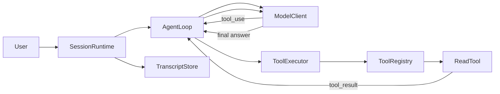
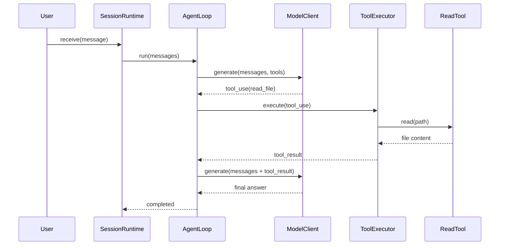

# Mini Coding Agent · Episode 02

这是 Mini Coding Agent 教学系列第二集：**模型如何真正“伸手”操作代码？Tool Protocol × Read Tool**。

Episode 01 建立了 `SessionRuntime` 和 `AgentLoop`。Episode 02 在同一边界上加入结构化工具协议，让离线 Mock 模型通过真实的 `tool_result` 分析文件，而不是自己接触文件系统。

## 本集核心链路



- 模型只能提出结构化 `tool_use`，不能直接读取文件；
- `ToolRegistry` 限定模型能请求哪些工具；
- `ToolExecutor` 统一查找、校验、执行和包装结果；
- `ReadTool` 只读取显式 workspace 内的 UTF-8 普通文件；
- `tool_result` 回填 messages 后，模型才能依据真实代码回答；
- `SessionRuntime` 持久化完整文本和工具轨迹。

## 快速开始

需要 Node.js 20 或更高版本，不需要 API Key，也不会访问网络。

```bash
npm install
npm run demo:episode-02
npm test
npm run check
```

交互运行：

```bash
npm run dev
```

输入 `exit` 退出。Episode 01 风格的无工具 Demo 仍可运行：

```bash
npm run demo:episode-01
```

## 真实 Demo 流程

默认问题是：

```text
请读取 examples/login/auth.ts，并分析登录后 Token 立刻过期的原因。
```

执行顺序：

```text
user
→ assistant tool_use(read_file)
→ tool_result(真实 auth.ts 内容)
→ assistant final answer
```

最终会指出 `issuedAtSeconds` 与 TTL 使用秒，而 `Date.now()` 返回毫秒，直接比较导致 Token 被错误判断为过期。本集只分析，不修改示例。

## 工具时序



## workspace 安全

`ReadTool` 不使用全局工作目录。CLI 显式提供 `workspaceRoot`，工具通过 `realpath` 和 `path.relative` 检查最终真实路径，因此会拒绝：

- `../` 路径穿越；
- workspace 外的绝对路径；
- 指向 workspace 外部的符号链接；
- 目录、不存在文件和超过 256 KiB 的文件；
- 已中止的读取操作。

ReadTool 标记为 `isReadOnly: true`，只调用异步读取 API，不提供写入能力。

## messages 与 Transcript

Episode 02 使用可辨识联合类型保存 `text`、`tool_use` 和 `tool_result`。`buildMessagesForQuery()` 暂时保留完整历史，确保工具请求与结果不会被裁剪拆散；Token Budget 和 Compact 将在后续课程加入。

JSONL 文件位于：

```text
transcripts/<sessionId>.jsonl
```

其中工具字段保持结构化，不会被拼进普通文本。运行数据已被 `.gitignore` 排除。

## 目录

```text
src/
├── agent/        # 推动模型—工具—观察循环
├── cli/          # 交互 CLI、Demo 与依赖组装
├── context/      # 构造本轮模型上下文
├── model/        # ModelClient、Mock、ScriptedModelClient
├── runtime/      # 管理完整 Session 生命周期
├── tools/        # Protocol、Registry、Executor、ReadTool
├── transcript/   # JSONL 执行轨迹
└── types/        # Message、ToolUse、ToolResult 等协议
examples/login/   # 教学用秒/毫秒 Bug
tests/            # 工具、安全、循环与运行时测试
docs/             # Episode 01/02 架构说明
```

## MockModelClient 不会偷读文件

Mock 第一次调用只返回 `read_file` 请求。第二次调用只查找 messages 中成功的 `ToolResultMessage`；它没有导入任何文件系统 API。换成真实模型时，`AgentLoop`、工具层和 Runtime 边界无需改变。

## 当前未实现

本集不会修改文件或执行 Bash，也没有 Edit、Diff、Permission UI、Compact、Resume、Replay、多 Agent、MCP、真实模型 API 或 Web UI。

Episode 03 将沿用 `Tool`、`ToolRegistry`、`ToolExecutor` 和结构化消息协议，实现 **Edit Tool × Diff × Permission**。

更多解释见 [Tool Protocol 架构文档](docs/episode-02-tool-protocol.md)。
