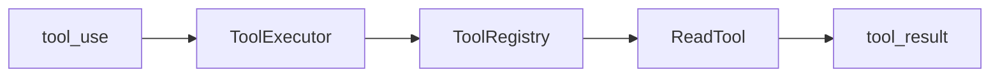
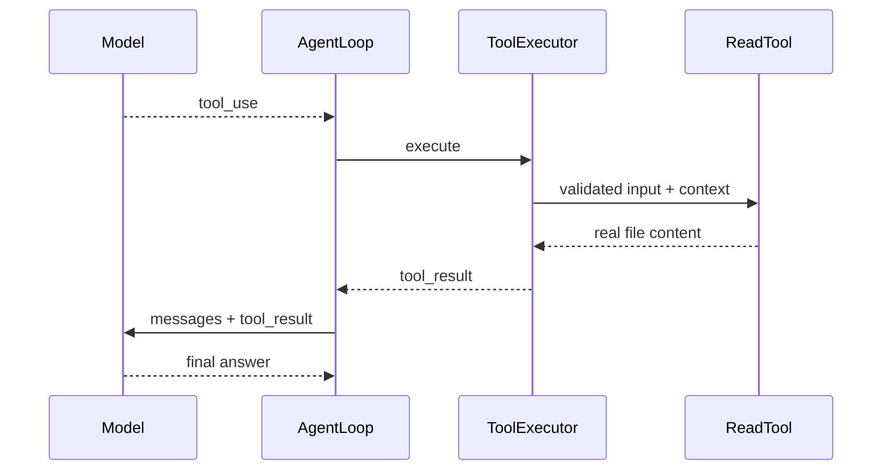

# Episode 02：Tool Protocol × Read Tool

## 模型为什么不能直接操作文件

模型的输出本质上是数据。它可以说“我想读取 `auth.ts`”，但真正接触磁盘的是受 Runtime 控制的代码。如果让模型绕过协议直接访问文件，就无法统一校验路径、记录轨迹或中止危险动作。

本集让模型返回：

```json
{
  "id": "use-1",
  "name": "read_file",
  "input": { "path": "examples/login/auth.ts" }
}
```

这只是提议，不是已经执行的动作。

## tool_use 与 tool_result

`tool_use` 表示模型想做什么；`tool_result` 表示环境实际观察到了什么。两者通过 `toolUseId` 关联。

例如模型请求读取文件后，成功结果包含真实代码；路径越界时，结果则是 `ok: false` 和稳定错误码。失败也要回填，因为模型需要看到“动作没有成功”，才能调整下一步。

## Tool 不只是普通函数

普通读取函数通常只有参数和返回值。一个 Agent Tool 还必须提供：

- 唯一名称和给模型看的描述；
- 模型可见的输入 Schema；
- 对 `unknown` 输入的运行时校验；
- 是否只读等安全元信息；
- 显式 `ToolContext`，包括 workspace 和中断信号。

例如 `ReadTool` 只接受 `{ path: string }`，多余字段和绝对路径会在执行前被拒绝。

## Registry、Executor、ReadTool 如何分工

`ToolRegistry` 是允许列表。没有注册的 `delete_file` 请求只能得到 `UNKNOWN_TOOL`，不会被动态创建。

`ToolExecutor` 是统一入口，固定执行“查找 → 校验 → 检查中断 → 执行 → 包装结果”。它不知道 ReadTool 的文件细节，因此 Episode 03 注册 EditTool 时无需增加工具名分支。

`ReadTool` 只负责一件事：在 workspace 安全边界内读取 UTF-8 普通文件。



## workspace 安全边界

假设 workspace 是 `/project/episode-02`，合法路径 `examples/login/auth.ts` 会被解析到其中。检查流程是：

1. 获取 workspace 的真实绝对路径；
2. 解析请求路径；
3. 获取目标的真实路径；
4. 用 `path.relative()` 判断最终目标是否仍在 workspace 内；
5. 检查普通文件、可读性和 256 KiB 上限；
6. 使用 UTF-8 异步读取。

只做字符串 `startsWith()` 不够，因为 `/project/app-secret` 可能错误匹配 `/project/app`。只检查 `../` 也不够，因为 workspace 内的 symlink 可以指向外部。真实路径检查同时覆盖这两类逃逸。

## 为什么结果必须回填 messages

MockModelClient 没有文件系统能力。第一次它只提出 ReadTool 请求；AgentLoop 将请求和结果依次追加后，第二次模型调用才会看到：

```text
Date.now() 返回毫秒，而 expiresAtSeconds 使用秒
```

没有 `tool_result`，模型只能猜测；有了结构化观察，它才能基于真实代码判断。

## 完整工具循环



`AgentLoop` 推动每一轮，`SessionRuntime` 仍然拥有整场任务的 messages、status、Transcript 和 AbortController。

## 为什么本集只做 Read

读取是低风险、最容易看清协议闭环的动作。Edit 还需要变更预览、Diff、用户授权和原子写入；Bash 则涉及更复杂的命令风险。如果本集同时加入它们，工具协议和生命周期的主线会被安全 UI 淹没。

Episode 03 可以实现新的 `EditTool` 并注册到同一个 Registry，在 ToolExecutor 之前加入 Permission 决策，同时复用 `tool_use/tool_result`、Transcript 和 AgentLoop 循环。
